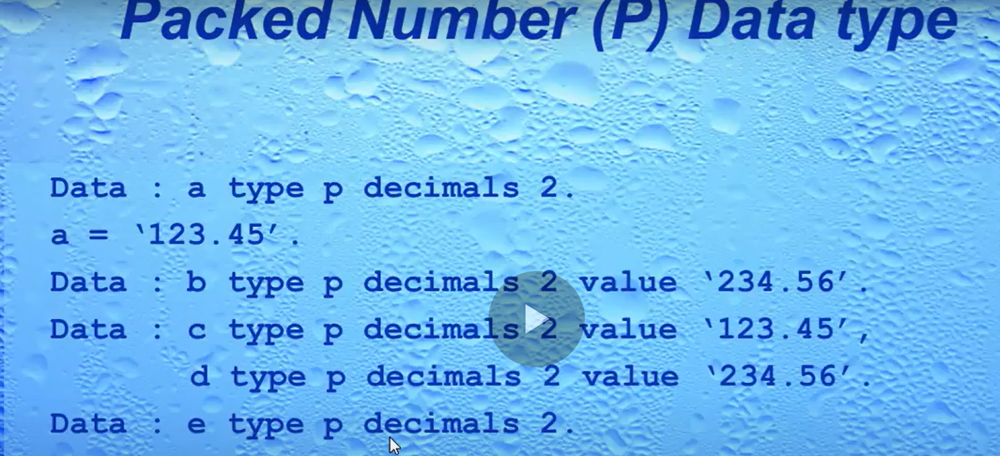
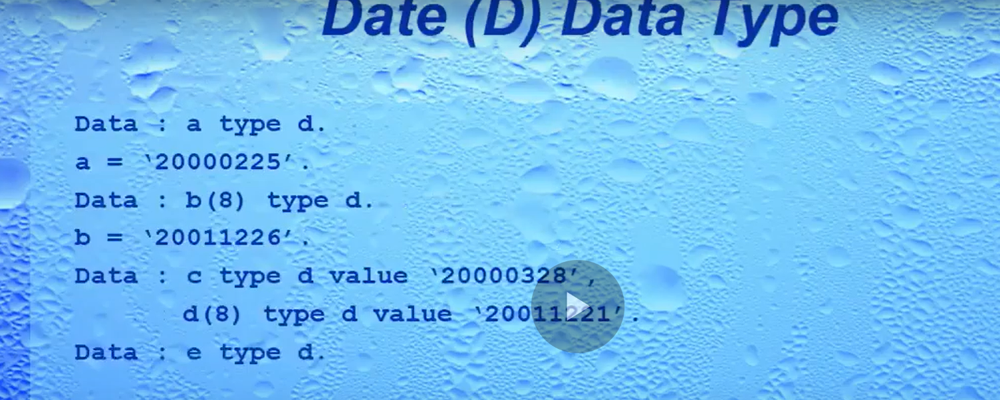
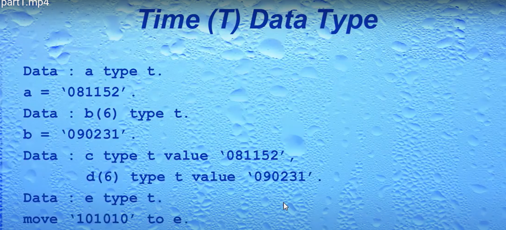
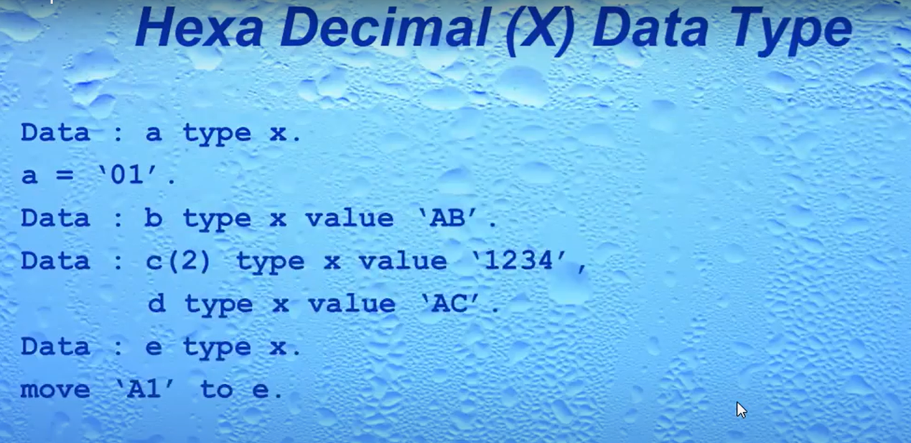
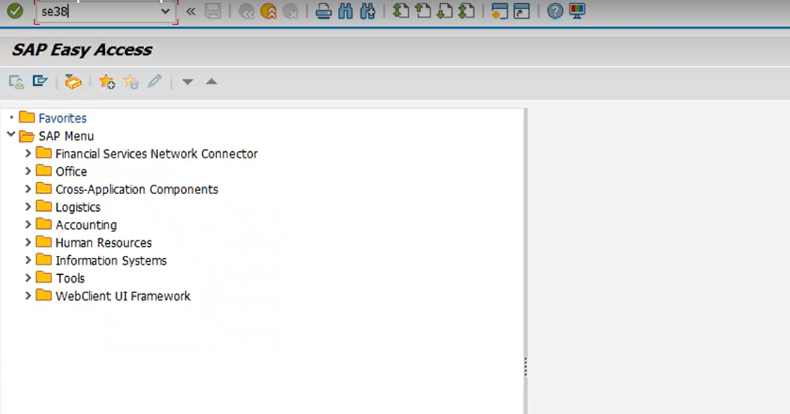
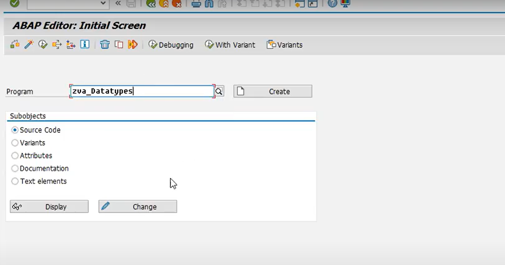
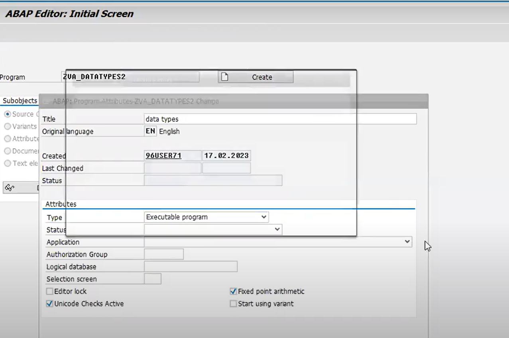
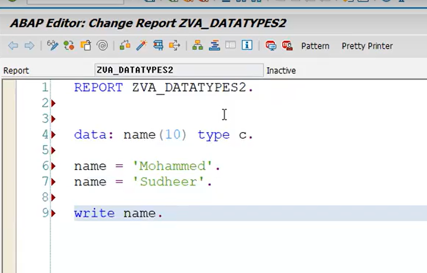
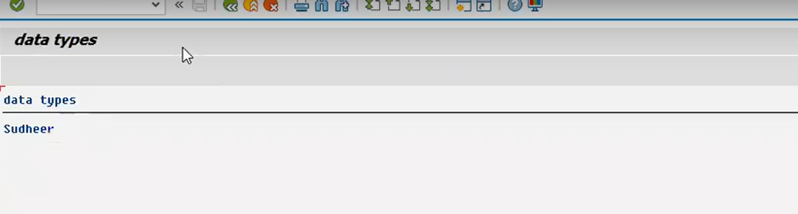

# ABAP-Basics
Basic-concepts-in-programming

 # 1. Basic concepts 
 

 # 2. Basic concepts
 

 # 3.Basic concepts
 

 # 4.Basic concepts
 

 # 5.Basic concepts
 

 # 6.Basic concepts
 

 # 7.Basic concepts
 

  # 8.Basic concepts
 

  # 9.Basic concepts
 

  # 10.Basic concepts
 
 
  # 11.Basic concepts
 
 
  # 12.Basic concepts
 
 
  # 13.Basic concepts
 
 
  # 14.Basic concepts
 

  # 15.Basic concepts
 
